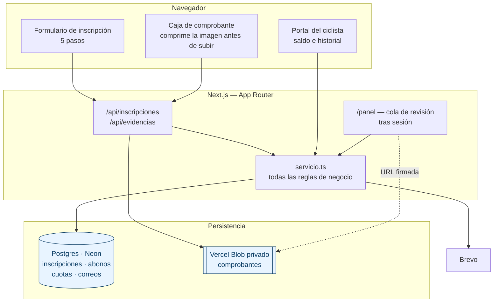
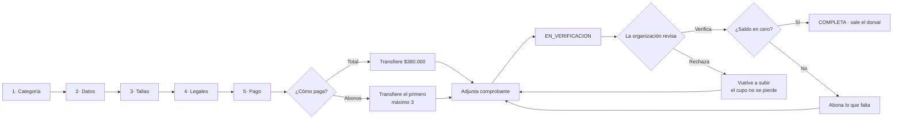
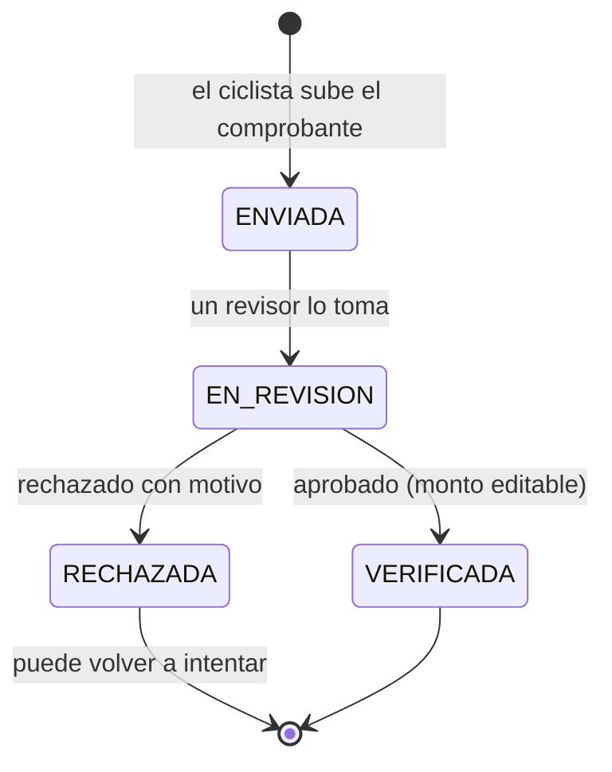
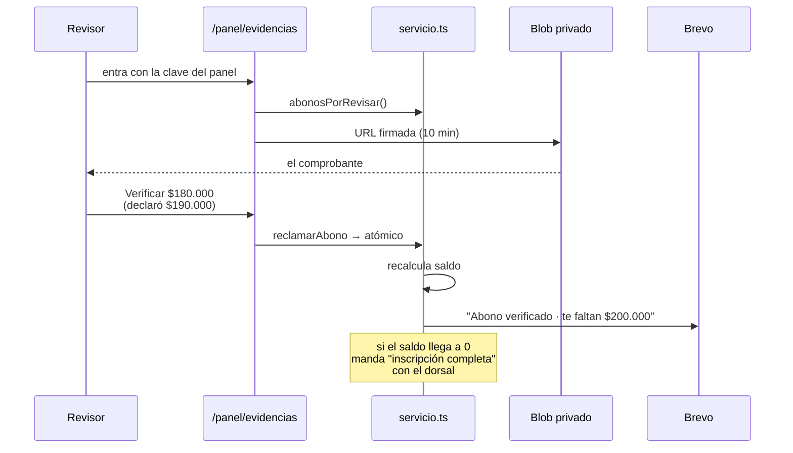
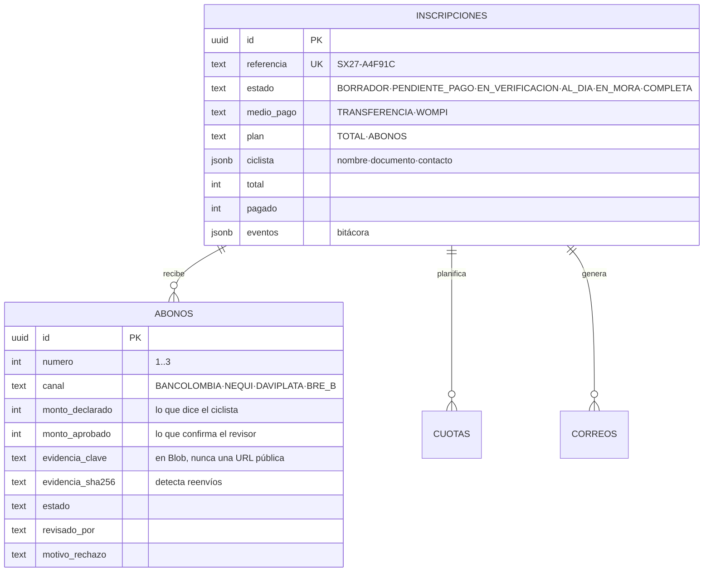

# Santander Xtreme 2027 — inscripciones y recaudo

Plataforma de inscripción y cobro para la **10ª edición "El Legado"**, maratón
de montaña (MTB · XCM · 2 etapas) del 3 al 5 de julio de 2027 en Barichara,
Santander.

El ciclista se inscribe en cinco pasos, paga **por transferencia bancaria** —de
una o hasta en tres abonos— y **adjunta el comprobante**. La organización lo
revisa a mano y aprueba. Cuando el saldo llega a cero, sale el dorsal.

## Arranque

```bash
pnpm install
cp .env.example .env.local     # y rellena lo que necesites
node --env-file=.env.local scripts/migrar.mjs
pnpm dev
```

Sin `DATABASE_URL` la aplicación guarda en `.datos/` (archivos JSON), sin
`BREVO_API_KEY` los correos se renderizan y quedan en `/correos` en vez de
enviarse, y sin `BLOB_READ_WRITE_TOKEN` los comprobantes se guardan en disco.
**Todo el flujo se puede demostrar sin una sola credencial.**

## Arquitectura



El almacén es intercambiable: `src/lib/almacen/index.ts` elige Postgres o
archivos JSON según haya `DATABASE_URL`. Lo mismo el almacenamiento de
comprobantes y el envío de correo. Esa simetría es deliberada — permite correr
la demo completa sin credenciales y sin ramas `if` regadas por el código.

## El flujo de inscripción



## Pagos

### Por qué el cobro es manual

La organización recauda por transferencia a sus propias cuentas —Bancolombia
Ahorros, Nequi, Daviplata y Bre-B— y **verifica cada comprobante a mano**. No
hay pasarela cobrando: el dinero lo empuja el ciclista, nadie le cobra.

Eso tiene una consecuencia de diseño que conviene entender: **el monto y la
fecha los decide el ciclista**, no un calendario. Por eso la verdad del saldo
no es una tabla de cuotas programadas sino la suma de los abonos verificados.

```
saldo = total − Σ(abonos verificados)
```

### Las dos formas de pagar

- **Pago total**: un movimiento por $380.000.
- **Dos cuotas**: $190.000 al inscribirse y $190.000 **45 días después**.

La fecha de la segunda cuota se ancla a la inscripción, no a cuándo se
verifique la primera: el ciclista no controla cuándo revisa la organización,
así que ve las dos fechas desde el minuto uno.

Esa fecha se acota contra el cierre de comprobantes —`min(inscripción + 45
días, FECHA_LIMITE_ABONOS)`—, porque si no, quien se inscriba a tres semanas
de la carrera tendría la segunda cuota **después** de correrla. Y cuando ya no
quedan 15 días de margen, el plan directamente no se ofrece: la página lo
explica en vez de aceptarlo y fallar más tarde.

Un comprobante **rechazado no gasta intento**. El excedente (si alguien
transfiere de más) se expone aparte y **nunca** hace el saldo negativo.

### Ciclo de vida de un abono



`EN_REVISION` no es decorativo: es lo que impide que **dos personas de la
organización aprueben el mismo comprobante a la vez**. Se entra a ese estado
con un `UPDATE` condicional atómico (`reclamarAbono`), no con un
lee-modifica-escribe.

### Revisión



Detalles que importan en esta pantalla:

- **El monto se puede corregir.** El ciclista declara $190.000 y transfirió
  $180.000: pasa constantemente. Manda siempre `montoAprobado`.
- **Rechazar exige motivo** — el ciclista lo lee en su correo.
- **La evidencia repetida se marca**: la misma captura enviada en dos
  inscripciones se detecta por SHA-256 del contenido.
- **El nombre del revisor sale de la sesión**, nunca del cuerpo de la petición.

### Qué protege el dinero

Tres barreras independientes, cada una por un incidente distinto:

| Riesgo | Defensa |
|---|---|
| Dos revisores aprueban el mismo abono | `UPDATE` condicional atómico |
| Alguien reenvía la misma captura | SHA-256 del contenido, marcado en la cola |
| Un ejecutable disfrazado de `.jpg` | Tipo detectado por **bytes mágicos**, no por lo que declara el navegador |
| Un comprobante filtrado | Blob privado + URL firmada de 10 min + sesión exigida dos veces |

## Seguridad

`/panel` y `/correos` están detrás de una **clave compartida** (`PANEL_CLAVE`)
con cookie firmada por HMAC (`PANEL_SECRETO`). La comparación de la clave es en
tiempo constante para que el tiempo de respuesta no la filtre.

En Next 16 el fichero se llama `src/proxy.ts` — `middleware.ts` está
deprecado. El proxy es la primera barrera; **las rutas que devuelven
comprobantes vuelven a comprobar la sesión por su cuenta**, para que cambiar el
matcher no las deje abiertas en silencio.

> **Esto no es identidad por persona.** El revisor escribe su nombre al entrar
> y ese nombre queda en `revisado_por`, pero cualquiera con la clave puede
> escribir cualquier nombre. Sirve mientras revise un equipo pequeño y de
> confianza; **no sirve como auditoría formal**. Si van a revisar varias
> personas, hace falta un usuario por cabeza.

Un comprobante bancario lleva nombre, cuenta y montos: es dato personal bajo la
Ley 1581. Nunca se sirve desde una carpeta pública ni por una URL adivinable.

## Modelo de datos



`monto_aprobado` manda sobre `monto_declarado` en toda cuenta de dinero. Una
restricción de la base impide que un abono quede verificado sin cifra: dinero
sin monto no es dinero.

Los abonos **no** pasan por `guardarInscripcion`, que borra y reinserta cuotas
en cada guardado. Borrar y reinsertar evidencias con su historial de revisión
sería destructivo, así que tienen sus propias funciones de acceso.

## Correos

Once plantillas, todas en `src/lib/correos/plantillas.ts` y visibles
renderizadas en `/correos`. Las que importan en pago manual:

| Plantilla | Cuándo |
|---|---|
| `evidenciaRecibida` | Al subir el comprobante |
| `evidenciaVerificada` | Aprobado, con el saldo que queda |
| `evidenciaRechazada` | Rechazado, con el motivo y cómo reintentar |
| `inscripcionCompleta` | Saldo en cero, con el dorsal |
| `recordatorioCuota` | Faltan días y hay saldo |
| `cambioDeCompetidor` | Cesión del cupo |

> El recordatorio decía **"no tienes que hacer nada"** cuando cobraba la
> tarjeta. En pago manual es exactamente al revés y ahora dice *"este pago no
> sale solo"*. Invertirlo era el error más caro de esta migración.

Un fallo al enviar correo **no revierte la aprobación**: verificar mueve
dinero, notificar no. Una caída del proveedor no puede hacerle creer al revisor que
la aprobación falló.

## Cambio de competidor

La política del evento no devuelve dinero pero **sí permite ceder el cupo**.
Se hace desde `/panel/competidor`: se reemplazan los datos de identidad
conservando referencia, categoría y todo lo pagado, queda constancia en la
bitácora de quién lo hizo y cuándo, y se avisa a la persona nueva.

Los campos arrancan **vacíos** a propósito: prellenarlos con los del titular
anterior haría que, al no tocar el correo, la constancia se fuera a quien
perdió el cupo.

## Variables de entorno

```bash
# Base de datos (Neon o cualquier Postgres). Sin esto, archivos JSON en .datos/
DATABASE_URL=

# Panel de la organización
PANEL_SECRETO=      # firma la cookie; ≥16 caracteres
PANEL_CLAVE=        # la que se le da a quien revisa

# Comprobantes. Sin esto se guardan en .datos/evidencias/
BLOB_READ_WRITE_TOKEN=

# Correo — Brevo. Sin esto, en desarrollo se renderizan en /correos; en
# producción se marcan como NO ENVIADOS y se avisa en pantalla.
BREVO_API_KEY=
# Exige dominio propio verificado. Un remitente de Gmail se rechaza.
CORREO_REMITENTE=
CORREO_RESPUESTA=   # aquí sí puede ir el Gmail de la organización

# Cuentas de recaudo. Tienen valor por defecto en el código; estas variables
# permiten cambiarlas sin desplegar. Nequi, Daviplata y Bre-B comparten celular.
RECAUDO_TITULAR=
RECAUDO_BANCOLOMBIA=
RECAUDO_CELULAR=

# Cron de recordatorios (lo inyecta Vercel)
CRON_SECRET=
```

## Scripts

```bash
node --env-file=.env.local scripts/migrar.mjs                # crea el esquema
node --env-file=.env.local scripts/migrar.mjs --sin-importar # solo el esquema
node --env-file=.env.local scripts/sembrar-demo.mjs          # datos de ejemplo
```

`scripts/migrar.mjs` es idempotente. Si añades una columna, refléjala también
en el importador: ya se perdió una en silencio por olvidarlo.

## Pendientes antes de producción

- [ ] **Identidad por persona en el panel** si va a revisar más de una.
- [ ] **Rotar credenciales**: las llaves y la cadena de conexión que se usaron
      en desarrollo viajaron por chat. Trátalas como comprometidas.
- [ ] **Dominio propio verificado en Brevo.** Es lo único bloqueante del
      correo: los remitentes de Gmail se rechazan. Unos 12 USD/año de dominio
      más tres registros DNS. Las respuestas pueden seguir llegando al Gmail
      de la organización vía `CORREO_RESPUESTA`.
- [ ] **Política de mora**: qué pasa con quien no termina de abonar.
- [ ] **Retención de comprobantes**: cuánto se guardan y quién puede verlos.
- [ ] **Aviso si el cron falla** — hoy falla en silencio.
- [ ] Datos que el cliente no ha entregado: cupo total, altimetría real, km y
      desnivel por categoría, y fecha de cierre de inscripciones.
